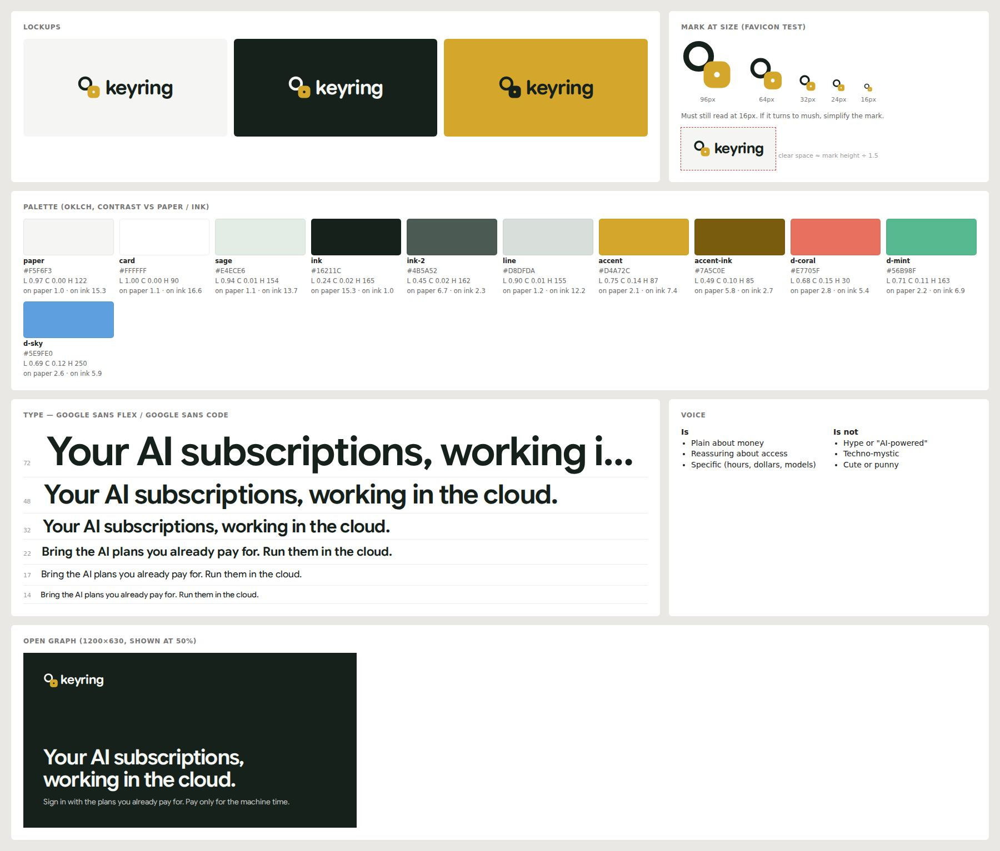

# Demo 3: "keyring", brand system + 3D object from a one-line prompt

Prompt: *"a website for a company that lets you use your AI subscription models in the cloud"*. Quick mode, with zero questions asked. The skill created the brand, the 3D hero, and the site. Open `site/index.html`.

## What was new this round
| Capability | Where | Used here |
|---|---|---|
| Brand system (metaphor → mark → wordmark → palette roles → devices) | `references/brand.md` | Metaphor from the mechanism: *you already own the keys*. 4 marks drawn and judged at 16–96px |
| Brand board + assets | `scripts/brandboard.mjs` | `.design/brand/board.jpg`, `og.png`, `favicon.svg`, `mark-*.svg`, `tokens.css` |
| Awkward / AI palette audit | `scripts/palette.mjs` (`lib/color.mjs`, OKLCH) | Caught `ink ≈ night` and `paper ≈ on-ink` duplicates, plus fills misnamed as accents |
| 3D object recipe | `references/3d.md` | Procedural Three.js keyring: steel ring, brass key, fobs engraved in the brand face, RoomEnvironment lighting, SVG fallback, paused offscreen, still frame under reduced motion |
| Round-font preference | `lib/fonts.mjs`, lint `condensed-font` / `squished-type` / `thin-type`, shoot | **Google Sans Flex** with its `ROND` (roundness) axis at 100 for display; Google Sans Code for mono |

## Decisions recon drove
- **Category look measured:** Ona `#f9f9f9` and Factory `#f5f5f5` near-white grey + black, Geist / Diatype, full-width video heroes. keyring went **warm paper + ink green + brass**, round type, and a physical object.
- **Adjacent world:** Orbitkey (key organisers) shows the product *as an object*. That became the 3D keyring, the one memorable thing.
- **Marks rejected on sight at 16px:** ring + handle (reads as a search icon), cloud + keyhole (security-vendor cliché), two rings (chain link). Kept: ring + fob with a real cut-out hole.

## What verification caught (2 rounds, budget respected)
| Found | By | Fix |
|---|---|---|
| "acme" repo names | slop-lint `placeholder` | realistic repo names |
| Fobs overlapping (labels hidden) | looking at the sheet | spread angles, yaw and depth |
| Headline 4 lines at 1440 | sheet vs `patterns.md` (≤ 2) | full-width headline; the keyring tucks under it (type + object integration) |
| Nav overflow at 768 | shoot | menu breakpoint at 900 |
| 15 type sizes, 9 radii | shoot | 14/16/18/22/32/48/72 and 6/12/22/pill |
| Toggle label "1.39:1" | shoot, **false positive** | **Verifier fix:** contrast now hit-tests what's painted under the text (sibling thumbs), scrolling offscreen elements into view first |
| `status-wait` treated as an accent | palette, **checker gap** | **Checker fix:** wait/pending/busy recognised as status |

Final: lint 100/100, palette clean, shoot clean at 390/768/1440, WebGL verified rendering in headless (SwiftShader), reduced motion respected.

