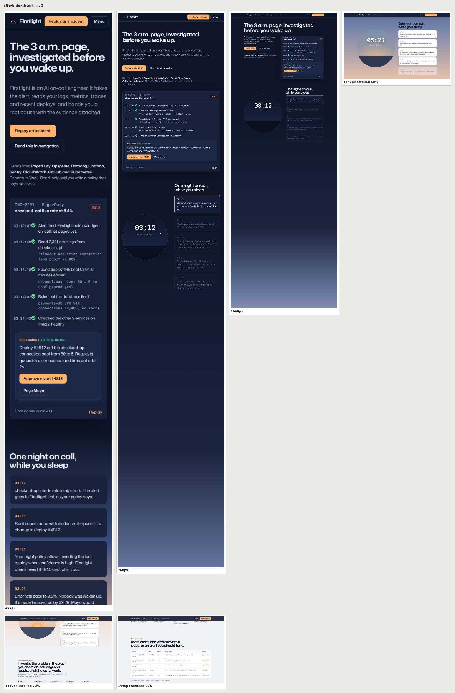

# Demo 2: "Firstlight", an AI SaaS site from a one-line prompt

The prompt was deliberately vague: *"a modern AI-centred/branded SaaS website"*. The skill treats vagueness as delegation (quick mode). It chose the product, audience, direction, layout, motion, and copy itself, and wrote every choice into [`.design/brief.md`](.design/brief.md). **Zero questions were asked.**

**Open it:** `site/index.html` (one file; fonts from Google Fonts). Scroll slowly through "One night on call" and the page turns from night into morning. Also try **Read this investigation** (dialog), **Replay** on the product panel, and the **Pricing** and **Changelog** routes (view transitions), where the billing toggle and FAQ show in-page state motion.

## What the skill did
| Step | What | Evidence |
|---|---|---|
| Intake | Quick mode: picked an **AI on-call engineer** because it has a real, demonstrable task (an alert → an investigation with evidence), which avoids AI hype by construction | brief § Product |
| Recon | `recon.mjs` on incident.io, cursor.com, stripe.com, darksky.org (adjacent world: night sky) | `.design/recon/*/digest.md`, `board.html` |
| Motion recon | `motion.mjs` on stripe.com, incident.io, resend.com, linear.app | `.design/recon/*/motion.md` |
| Type | `specimen.mjs` rendered 7 less-worn candidates with the real headline on the real background → **Mona Sans** (one family: expanded display, normal text, condensed labels) + **Martian Mono** for log lines only | brief § Tokens |
| Build | `site/index.html` | — |
| Verify | lint 100/100 · 3 shoot rounds (budget-capped) | `.design/shots/` |

## What recon changed
- **Palette:** both AI-dev competitors measured as *warm paper + orange* (incident.io `#f1ebe2`/`#f25533`, Cursor `#f7f7f4`/`#f54e00`), which is the category look. Firstlight took the opposite: **navy night → cool dawn with one amber**, derived from the job itself (being on call at night).
- **Motion restraint, measured:** scroll reveals per homepage are Stripe 1, Linear 2, incident.io 4. Stripe and incident.io don't use view transitions (Stripe does a full page load). So Firstlight spends motion in **one** place (the scroll-linked night → dawn story). Everything else is state motion: billing toggle indicator plus number flip, FAQ height, dialog rise, route crossfade with a shared title.
- **Hero:** Cursor's measured hero puts the product (its agent UI) under a 9-word left-aligned H1. Firstlight's hero *is* a real investigation (alert → logs → deploy diff → ruled-out hypotheses → root cause → approve/page), not an orb or a chat bubble.

## What the verifier caught
| Round | Found | Fix |
|---|---|---|
| lint | `cream-clay` fired on a tiny callout tint and a sun-gradient stop | **Linter fix:** cream now counts only as a page ground or surface token (real cream+clay still caught) |
| lint | 5 middle-dot meta strings | rewritten |
| v1 | H1 wrapped to 5 lines at 1440 (the patterns target is ≤ 2) | headline moved to its own full-width row |
| v1 | nav overflowed at 768px | menu breakpoint 720 → 900 |
| v1 | 10 type sizes, 6 radii | collapsed to the brief's 4/8/14 ladder |
| v1 | auto-replay made the first frame a half-finished investigation | replay is click-only; complete at rest |
| v3 | "−20%" green at 4.25:1 | `--ok` darkened |
| v3 | focus warning after `--click` | **Verifier fix:** shoot switches to keyboard modality before testing focus |

Final: lint 100/100, no overflow at 390/768/1440, contrast and focus clean, reduced motion respected (the scroll story degrades to static per-section colours), no console errors.

