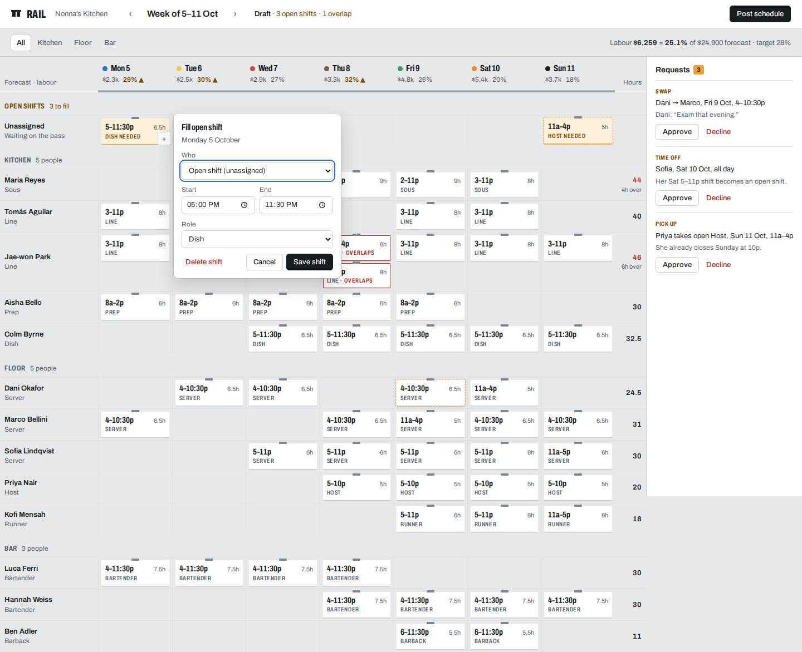

# Test run: "Rail", restaurant shift scheduling

End-to-end run of the `design-recon` skill on a product web app, in **quick mode** (intake answers inferred and stated, as the skill says to do when the developer gives no detail).

**Open the app:** `app/index.html` (no build step). **Try:** approve the three requests, press *Post schedule* (it catches the overlap first), click any ticket or empty cell, use `›` to reach an empty week, or narrow the window below 760px for the phone view.

## What happened, step by step

| Step | Output | Cost to the model |
|---|---|---|
| 1 Context | New project, nothing to read | — |
| 2 Intake (quick) | One-line assumptions → [`.design/brief.md`](.design/brief.md) | 0 questions |
| 3 Recon | 4 sites: 7shifts and Homebase (competitors), Linear (craft), DayMark (adjacent world: kitchen food-rotation labels). Output: `digest.md` + `sheet.jpg` each, plus [`board.html`](.design/recon/board.html) | ~4k tokens of digests + 1 board image |
| 4 Direction | "Ticket rail": tokens, ASCII layout, one memorable thing, slop pre-check (in the brief) | — |
| 5 Build + verify | `app/`. Linted 100/100, then 4 shoot rounds (v1 → final), each fixing what the report or the sheet showed | 1 sheet image per round |
| 6 Log | [`.design/log.md`](.design/log.md) | 4 lines |

### What recon changed
- Both competitors own **blue/purple with rounded pastel blocks** (measured: 7shifts `#4570ff` pill buttons, radii 12/20px; Homebase `#7e3dd4`, radii 20/10px). Rail went **steel + paper + heat-lamp amber with 1px-radius tickets** to be recognisably different.
- From **Linear**: 1px low-alpha rules instead of shadows, 13px UI text, and the measured `100–160ms cubic-bezier(.25,.46,.45,.94)` timing.
- From **DayMark** (the adjacent world): a hard, unblurred offset shadow (`0 3px 0`), which became the ticket's paper edge, plus the **day-dot colour system** kitchens already use on food labels, which became the day headers.

### What the verifier caught (fixed)
| Round | Found by | Issue |
|---|---|---|
| v1 | `shoot.mjs` contrast audit | overtime red `#C4382F` at 4.32:1 → `#B02A22` |
| v1 | `shoot.mjs` console | font preload fails over `file://` → shoot now serves local files over http |
| v1 | looking at the sheet | `28.000000000000004%`; empty state rendering under the grid; implausible 16% labour |
| v2 | looking at the sheet | rows ~100px tall from invisible add targets → 24px corner "+" |
| v3 | `shoot.mjs` target audit | that "+" was 22px (< 24px WCAG 2.2) → 24px |
| — | `slop-lint.mjs` (on itself) | an empty `lint-allow:` swallowed the next line; `type="submit"` flagged as copy. Both linter bugs fixed |

## Result
Desktop with the shift editor open ([`final-editor/1440.jpg`](.design/shots/final-editor/1440.jpg)), and all breakpoints ([`final/sheet.jpg`](.design/shots/final/sheet.jpg)). First pass for comparison: [`v1/sheet.jpg`](.design/shots/v1/sheet.jpg).

### Slop check vs. a typical generated scheduler
The slop fixture ([`skills/design-recon/tests/fixtures/slop.html`](../../skills/design-recon/tests/fixtures/slop.html)) scores **0/100 with 19 findings**. This app scores **100/100** and passes the runtime audit (contrast, focus, targets, reduced motion, fonts loaded, no overflow). What the lint can't judge was checked by eye against `references/slop.md`: no KPI card row, no greeting, no icon tiles, no gradients, labour numbers in context, and real, specific content (names, roles, wages, forecasts, and requests with reasons).
